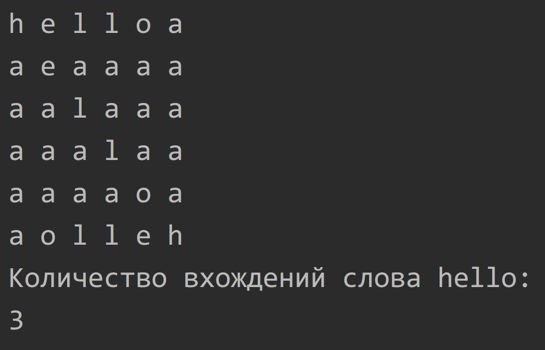
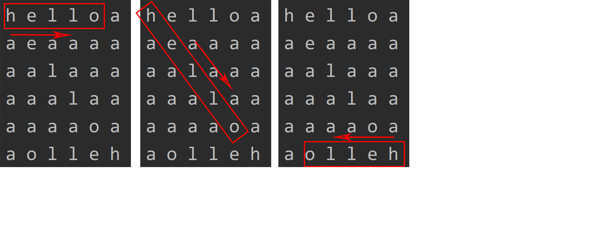
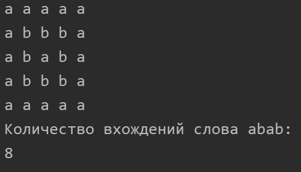

Воронов Вадим ИБ-119
# Лабораторная работа 9.
## Посчитать количество вхождений слова в матрице из символов.

Алгоритм выполнения:
 1) Проходимся по всем элементам матрицы с помощью вложенного цикла.
 2) Находим символ в матрице, совпадающий с первой буквой в слове.
 3) Учитывая координаты этого символа в матрице, делаем проверку по всем сторонам на совпадение остальных букв. (право, лево, верх, низ, лево-верх, право-верх, право-низ, лево-низ)
 4) Если по одному из направлений совпали все буквы слова, то прибавляем к результату единицу.

Если слово состоит из одного символа, то просто подсчитываем количество вхождений этого символа в двумерном массиве.

### Пример вывода программы:

Ещё один пример:

